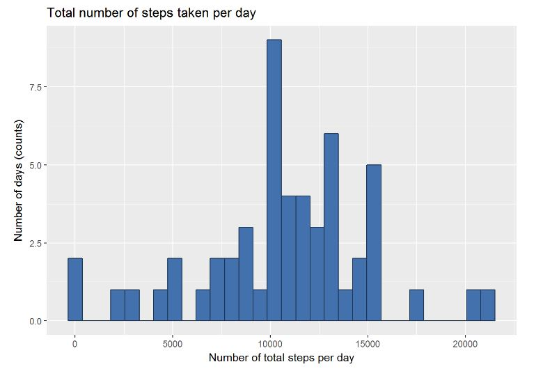
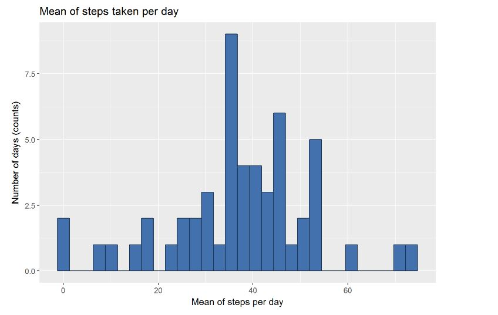
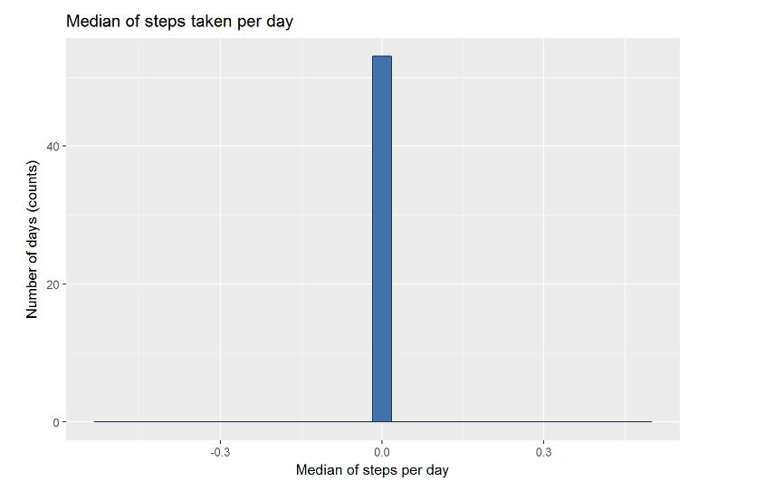
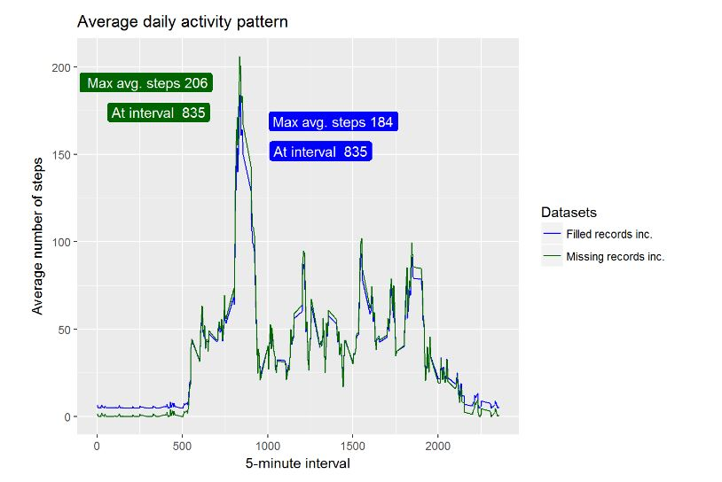
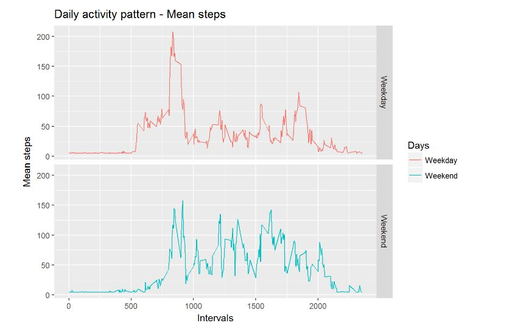

```{r setup, include=FALSE, echo=FALSE}
knitr::opts_chunk$set(echo = TRUE)
```
## Reproducible Research: Peer Assessment 1

## Downloading and preparing data

Data has to be downloaded and necessary libraries have to be loaded
into R environment.

Please pay attenttion to the location of the working directory and where
data has been downloaded and unziped.

```{r}
setwd("D:/")

path <- getwd()
url <- "https://d396qusza40orc.cloudfront.net/repdata%2Fdata%2Factivity.zip"
f <- "Data.zip"
if (!file.exists(path)) {
    dir.create(path)
}
download.file(url, file.path(path, f))

executable <- file.path("C:", "Program Files", "7-Zip", "7z.exe")
parameters <- "x"
cmd <- paste(paste0("\"", executable, "\""), parameters, paste0("\"", file.path(path, f), "\""))
system(cmd)

library(ggplot2)
library(data.table) 
library(dplyr)
list.files()

```

## Loading data

Now we load data from .CSV file info data frame. We are disabling factors and
looking for strings which may by missing values (e.g. NAs)

```{r}
ActData <- read.csv("activity.csv", 
                #colClasses = "character", 
                stringsAsFactors = FALSE, 
                na.strings=c(NA,"NA"," NA", "Not Available"))


ActData$date <- as.Date(ActData$date, "%Y-%m-%d")

head(ActData)

```


# What is the total number of steps taken per day?
Below is the code used to generate the chart which is after.

```{r}
Step_days_sum <- tapply(ActData$steps, 
                        ActData$date, 
                        sum)

Step_days_sum <- melt(Step_days_sum)
    names(Step_days_sum) <- c("Date", "StepsTotal")
    Step_days_sum <- Step_days_sum[!is.na(Step_days_sum$StepsTotal),]

    barfill <- "#4271AE"
    barlines <- "#1F3552"

ggplot(Step_days_sum, 
       aes(x = Step_days_sum$StepsTotal)) + 
    geom_histogram(bins = 30, 
                   colour = barlines, 
                   fill = barfill) +
    scale_x_continuous(name = "Number of total steps per day") +
    scale_y_continuous(name = "Number of days (counts)") +
    ggtitle("Total number of steps taken per day") 
```
 


# What is the mean of steps taken per day?
Below is the code used to generate the chart which is after.

```{r}
Step_days_mean <- tapply(ActData$steps, 
                         ActData$date, 
                         mean)

Step_days_mean <- melt(Step_days_mean)
    names(Step_days_mean) <- c("Date", "StepsMean")
    Step_days_mean <- Step_days_mean[!is.na(Step_days_mean$StepsMean),]    

    barfill <- "#4271AE"
    barlines <- "#1F3552"

ggplot(Step_days_mean, 
           aes(x = Step_days_mean$StepsMean)) + 
        geom_histogram(bins = 30, 
                       colour = barlines, 
                       fill = barfill) +
        scale_x_continuous(name = "Mean of steps per day") +
        scale_y_continuous(name = "Number of days (counts)") +
        ggtitle("Mean of steps taken per day") 

```
 


# What is the median of steps taken per day?
Below is the code used to generate the chart which is after.

This example shows that median for each day is equal to 0, i.e. for each day
there are more than a half activities with number of steps equal to 0.

```{r}
ActData_t <- ActData[!is.na(ActData$steps),]
    
Step_days_median <- tapply(ActData_t$steps, 
                           ActData_t$date, 
                         median)

Step_days_median <- melt(Step_days_median)
    names(Step_days_median) <- c("Date", "StepsMedian")
    Step_days_median <- Step_days_median[!is.na(Step_days_median$StepsMedian),]    

    barfill <- "#4271AE"
    barlines <- "#1F3552"

ggplot(Step_days_median, 
       aes(x = Step_days_median$StepsMedian)) + 
    geom_histogram(bins = 30, 
                   colour = barlines, 
                   fill = barfill) +
    scale_x_continuous(name = "Median of steps per day") +
    scale_y_continuous(name = "Number of days (counts)") +
    ggtitle("Median of steps taken per day") 

```
 


# What is the average daily activity pattern?
Below is the code used to generate the chart which is after.

Please find (on the chart and below the chart) the 5-minute interval that, on average, contains the maximum number of steps.

```{r}
ActData_pattern <- ActData[!is.na(ActData$steps),]

ActData_pattern <- tapply(ActData_pattern$steps, 
                          ActData_pattern$interval,
                          mean)

ActData_pattern <- melt(ActData_pattern)

names(ActData_pattern) <- c("Intervals", "AvarageSteps")
MaxI <- ActData_pattern[which.max(ActData_pattern$AvarageSteps),]

ggplot(ActData_pattern, 
       aes(x = Intervals, 
           y = AvarageSteps)) + 
    geom_line() +
    labs(title = "Average daily activity pattern", 
         x ="5-minute interval",
         y = "Average number of steps") +
    geom_vline(xintercept=MaxI$Intervals,
               size = 1, 
               colour = "#FF3721",
               linetype = 2) + 
    geom_hline(yintercept=MaxI$AvarageSteps,
               size = 1, 
               colour = "#FF3721",
               linetype = 2) +
    geom_label(aes(x=MaxI$Intervals + 400, 
                   y =MaxI$AvarageSteps - 25, 
                   label = paste0("Max avg. steps ", round(MaxI$AvarageSteps, 0))), 
               fill = "red", 
               colour = "white") +
    geom_label(aes(x=MaxI$Intervals + 375, 
                   y =MaxI$AvarageSteps - 42, 
                   label = paste0("At interval  ", MaxI$Intervals)), 
               fill = "darkgreen", 
               colour = "white")

print(MaxI)
```
 


# Filling records with NAs approach

Strategy for filling records with NAs. There following approach: 
1. Filling where single records are missing within the day using; 
2. Calculate median for all steps for all days (call it Global median); 
3. Divide it by 288 (count of intervals for a one day); 
5. Put the result into missing records;

Below is the code used to generate the chart which is after the code 
and represents the difference in activity patterns between data-set
with and without missing values.

Please find (on the chart and below the chart) the 5-minute interval that, on average, contains the maximum number of steps.

```{r}
# Mean from all days without NAs
Step_days_sum <- tapply(ActData$steps, 
                        ActData$date, 
                        sum)

Step_days_sum <- melt(Step_days_sum)
    names(Step_days_sum) <- c("Date", "StepsTotal")
    Step_days_sum <- Step_days_sum[!is.na(Step_days_sum$StepsTotal),]

Global_median <- median(Step_days_sum$StepsTotal)
ActDataAll <- ActData

# Number of rows per each day
row_n <- row(ActData[ActData$date %in% as.Date("2012-10-01"),])
#[1] 288

# Filling missing records
ActDataAll$steps[is.na(ActDataAll$steps)] <- round(Global_median/288, digits = 0)

# Calculating mean for each interval acress all dataset
ActDataAll <- tapply(ActDataAll$steps, 
                     ActDataAll$interval,
                          mean)
ActDataAll <- melt(ActDataAll)

# Calculating max values - avg steps at interval
MaxIAll <- ActDataAll[which.max(ActDataAll$value),]
names(MaxIAll) <- c("Intervals", "AvarageSteps")
#-----------------
# Calculating activites pattern for dataset with missing values
# Calculation has been taken from previous task
    ActData_pattern <- ActData[!is.na(ActData$steps),]
    
    ActData_pattern <- tapply(ActData_pattern$steps, 
                              ActData_pattern$interval,
                              mean)
    
    ActData_pattern <- melt(ActData_pattern)
    
    names(ActData_pattern) <- c("Intervals", "AvarageSteps")
    MaxI <- ActData_pattern[which.max(ActData_pattern$AvarageSteps),]
#-----------------
    ActDataAll$value2 <- ActData_pattern$AvarageSteps
    names(ActDataAll) <- c("Intervals", "Filled_Included", "Missing_Included")
    ActDataAll <- melt(ActDataAll, id.vars = "Intervals")
    


ggplot(data = ActDataAll, 
       aes(x = Intervals, 
           y = value, colour = variable)) + 
    labs(title = "Average daily activity pattern", 
                x ="5-minute interval",
                y = "Average number of steps") +
    geom_line() + 
    scale_color_manual(values=c("blue", 
                                "darkgreen"), 
                       labels = c("Filled records inc.", 
                                  "Missing records inc."),
                       name = "Datasets") +
    geom_label(aes(x=MaxIAll$Intervals + 550, 
                   y =MaxIAll$AvarageSteps - 15, 
                   label = paste0("Max avg. steps ", 
                                  round(MaxIAll$AvarageSteps, 0))), 
               fill = "blue", 
               colour = "white") +
    geom_label(aes(x=MaxIAll$Intervals + 475, 
                   y =MaxIAll$AvarageSteps - 32, 
                   label = paste0("At interval  ", MaxIAll$Intervals)), 
               fill = "blue", 
               colour = "white") +
    geom_label(aes(x=MaxI$Intervals - 550, 
                   y =MaxI$AvarageSteps - 15, 
                   label = paste0(" Max avg. steps ", 
                                  round(MaxI$AvarageSteps, 0))), 
               fill = "darkgreen", 
               colour = "white") +
    geom_label(aes(x=MaxI$Intervals - 475, 
                   y =MaxI$AvarageSteps - 32, 
                   label = paste0("At interval  ", MaxI$Intervals)), 
               fill = "darkgreen", 
               colour = "white")

# Max values - avg steps at interval for data-set with filled values
print(MaxIAll)

# Max values - avg steps at interval for data-set with missing values
print(MaxI)
```
 


# Are there differences in activity patterns between weekdays and weekends?

Below is the code used to generate the chart which is after the code 
and represents the difference in activity patterns between weekdays and weekends.

```{r}
# Mean from all days without NAs
Step_days_sum <- tapply(ActData$steps, 
                            ActData$date, 
                            sum)
    
Step_days_sum <- melt(Step_days_sum)
names(Step_days_sum) <- c("Date", "StepsTotal")
Step_days_sum <- Step_days_sum[!is.na(Step_days_sum$StepsTotal),]
    
Global_median <- median(Step_days_sum$StepsTotal)
ActDataAllw <- ActData
    
# Number of rows per each day
row_n <- row(ActData[ActData$date %in% as.Date("2012-10-01"),])
#[1] 288
    
# Filling missing records
ActDataAllw$steps[is.na(ActDataAllw$steps)] <- round(Global_median/288, digits = 0)
    

# Adding additional variable Day with values indicating day name
ActDataAllw$Day <- weekdays(ActDataAllw$date)

# Put flag for each day -> Weekdays and Weekends
for (i in 1:nrow(ActDataAllw)){
    
    ifelse(ActDataAllw$Day[i] == "Saturday" | ActDataAllw$Day[i] == "Sunday", 
           ActDataAllw$Week[i] <- "Weekend", 
           ActDataAllw$Week[i] <- "Weekday")
    
}

ActDataAllw$Week <- as.factor(ActDataAllw$Week)
str(ActDataAllw)

# Calculating mean for each interval across all dataset taking into account weekdays & weekends 
ActDataAllw <- tapply(ActDataAllw$steps, 
                      list(ActDataAllw$interval, ActDataAllw$Week),
                         mean)
ActDataAllw <- melt(ActDataAllw)
names(ActDataAllw) <- c("Intervals", "Days","StepsMean")
str(ActDataAllw)

# Ploting showing differences in the patterns between weekdats and weekends for avg. steps
ggplot(data = ActDataAllw, 
       aes(x = Intervals, 
           y = StepsMean, colour = Days)) + 
    labs(title = "Daily activity pattern - Mean steps", 
         x ="Intervals",
         y = "Mean steps") +
    geom_line() +
    facet_grid(Days~.)
```
 


